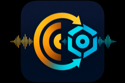

# MIK to Rekordbox

<p align="center">
  
</p>

Sync **Mixed In Key 11** playlists into **Rekordbox**, preserving track order from your MIK crate.

MIK stores playlists in `Collection11.mikdb` (SQLite). This tool reads that database and creates matching playlists in Rekordbox by matching file paths. Synced playlists appear under a **MIK Sync** folder in Rekordbox.

**Platforms:** macOS 12+ and Windows 10+ (MIK 11 + Rekordbox 6/7). Your tracks must already be in the Rekordbox library (same files MIK analyzed).

---

## Quick start (download)

Get the latest build from **[GitHub Releases](https://github.com/mountainstar/MIK-to-Rekordbox/releases)**:

| Platform | Download | Install |
|----------|----------|---------|
| Apple Silicon Mac | `MIK-to-Rekordbox-arm64.dmg` | Open DMG → **Install.command** (or drag app to Applications) |
| Intel Mac | `MIK-to-Rekordbox-x86_64.dmg` | Same as above |
| Windows 64-bit | `MIK-to-Rekordbox-win64.zip` | Extract zip → run `MIK-to-Rekordbox.exe` |

No Python install required for release builds.

1. Open **MIK to Rekordbox**.
2. Click **Refresh** to load MIK playlists.
3. Select one or more playlists.
4. Choose **Database (recommended)**, enable **Match by filename** if your files moved between drives or cloud folders.
5. **Fully quit Rekordbox** (macOS: Cmd+Q; Windows: close the app).
6. Click **Sync selected**.

Reopen Rekordbox — playlists are under **MIK Sync**.

> If a playlist you just created in MIK does not appear, switch to another playlist in MIK (or wait a few seconds) so MIK saves to `Collection11.mikdb`, then click **Refresh**.

---

## Sync methods

### Database sync (recommended)

Writes directly to Rekordbox’s `master.db`. Fastest and keeps everything in one library.

- **Rekordbox must be fully closed** before syncing.
- Use **Match by filename if path differs** when MIK and Rekordbox store different paths for the same file (common with cloud libraries).
- **Restore tracks Rekordbox marked missing** clears the “missing file” flag when the audio file still exists on disk.

### XML sync (alternative)

Use when you prefer not to touch the database, or for workflows that already rely on Rekordbox’s XML import.

1. In Rekordbox: **File → Export Collection in XML format** → save as `rekordbox.xml` in your Documents `rekordbox` folder.
2. In the app, choose **XML export** and sync.
3. In Rekordbox:
   - **Preferences → Advanced** → set XML import path to `rekordbox_mik_sync.xml`
   - Click the **XML refresh** button in the left tree
   - Open **MIK Sync → your playlist** → right-click → **Import Playlist**

Each XML sync rebuilds the whole **MIK Sync** folder from current MIK playlists (removed MIK playlists disappear from the sync file).

---

## Command line

After [development setup](#development-setup), with the virtual environment activated:

**macOS / Linux**

```bash
python mik_sync.py list
python mik_sync.py sync "My Playlist" --method db --basename-fallback
python mik_sync.py sync --all --method db --basename-fallback
python mik_sync.py gui
```

**Windows (PowerShell)**

```powershell
python mik_sync.py list
python mik_sync.py sync "My Playlist" --method db --basename-fallback
python mik_sync.py gui
```

### Useful flags

| Flag | Description |
|------|-------------|
| `--method xml\|db` | XML export or direct database write (CLI default: `xml`; GUI default: `db`) |
| `--all` | Sync every MIK playlist |
| `--basename-fallback` | Match by filename if full path fails |
| `--mik-db PATH` | Custom path to `Collection11.mikdb` |
| `--dry-run` | Preview track counts only |
| `--no-restore-hidden` | DB only: skip clearing Rekordbox “missing” flag |
| `--no-parent-folder` | Put playlists at root instead of **MIK Sync** |

---

## Development setup

For running from source or building installers locally.

**macOS**

```bash
git clone https://github.com/mountainstar/MIK-to-Rekordbox.git
cd MIK-to-Rekordbox
python3 -m venv .venv
source .venv/bin/activate
pip install -r requirements.txt
python mik_sync_gui.py
```

If tkinter is missing (common with Homebrew Python):

```bash
brew install python-tk@3.14
```

**Windows (PowerShell)**

```powershell
git clone https://github.com/mountainstar/MIK-to-Rekordbox.git
cd MIK-to-Rekordbox
python -m venv .venv
.\.venv\Scripts\Activate.ps1
pip install -r requirements.txt
python mik_sync_gui.py
```

If tkinter is missing, reinstall Python from [python.org](https://www.python.org/downloads/) and enable **tcl/tk and IDLE**.

---

## Build installers locally

**macOS** — standalone `.app` + DMG:

```bash
./scripts/build_release.sh
# → dist/MIK-to-Rekordbox.dmg
```

**Windows** — standalone `.exe` + zip:

```powershell
.\scripts\build_release_win.ps1
# → dist\MIK-to-Rekordbox-win64.zip
```

**macOS dev app** (thin wrapper, uses project `.venv`):

```bash
./scripts/build_mac_app.sh      # MIK to Rekordbox.app in project folder
./scripts/install_mac_app.sh    # copy to /Applications
```

---

## Publish a release (maintainers)

Pushing a version tag builds macOS DMGs (arm64 + Intel) and a Windows zip, then uploads them to GitHub Releases:

```bash
git tag v1.1.0
git push origin v1.1.0
```

See [.github/workflows/release.yml](.github/workflows/release.yml). Manual workflow runs from the Actions tab build artifacts only; a tag push creates the release.

---

## Default paths

| Item | macOS | Windows |
|------|-------|---------|
| MIK database | `~/Library/Application Support/Mixedinkey/Collection11.mikdb` | `%LOCALAPPDATA%\Mixedinkey\Collection11.mikdb` (also searches `Mixed In Key` folders) |
| Rekordbox XML export | `~/Documents/rekordbox/rekordbox.xml` | `%USERPROFILE%\Documents\rekordbox\rekordbox.xml` |
| XML sync output | `~/Documents/rekordbox/rekordbox_mik_sync.xml` | `%USERPROFILE%\Documents\rekordbox\rekordbox_mik_sync.xml` |
| Rekordbox database | `~/Library/Pioneer/rekordbox/master.db` | `%APPDATA%\Pioneer\rekordbox\master.db` (via pyrekordbox) |

Override MIK location with `--mik-db` if needed.

---

## How matching works

1. Read ordered file paths from MIK (`Z_1SONGS` + bookmark blobs).
2. Normalize paths and look them up in Rekordbox (XML `Location` or DB `FolderPath`).
3. Build the playlist with Rekordbox track IDs in the same order.

Unmatched files are listed in the log — usually the track is not in your Rekordbox collection yet, or paths differ (try **basename fallback**).

---

## Troubleshooting

| Issue | What to try |
|-------|-------------|
| Playlist missing after create/rename in MIK | Switch playlist in MIK, wait a few seconds, click **Refresh** |
| `Matched: 4` but only 1 track in Rekordbox UI | DB sync with **restore missing** enabled; quit and reopen Rekordbox |
| XML sync matches 0 tracks | Re-export full `rekordbox.xml` from Rekordbox first (export can be stale) |
| Paths differ (cloud / moved files) | Enable **Match by filename** |
| DB sync fails | Ensure Rekordbox is fully quit, not just minimized |
| Windows: app blocked | SmartScreen → **More info** → **Run anyway** (first launch) |
| macOS: app blocked | Right-click app → **Open** → **Open** (first launch) |

---

## MIK cue points vs playlists

**Mixed In Key → Export Cue Points → Rekordbox** maintains cue data in `rekordbox.xml`. This tool syncs **playlist order** from MIK crates, not cue points. You can use both workflows with different XML files.
